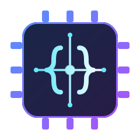

<p align="center">
  
</p>

<h1 align="center">mini-dsl-scala</h1>

<p align="center"><em>A tiny language that compiles code into circuits.</em></p>

---

A tiny programming language that **compiles to real FPGA hardware.**

You write a small imperative program in a Lox-like DSL; the compiler (written in
Scala 3) turns it into synthesizable **Verilog** with a **Wishbone** register
interface, plus a matching **Python client**, and then *proves the hardware is
correct* by simulating it and comparing against a reference interpreter.

The generated design targets the **Lattice ECP5-85F** FPGAs on the
[Manhattan Reasoning](https://manhattanreasoning.com) cloud, whose open toolchain
(Yosys · nextpnr · LiteX) synthesizes the Verilog and runs it on real silicon.

> **Source → Scanner → Parser → AST → Verilog + Python → FPGA**

> **📖 Built on and inspired by _Crafting Interpreters_.** The lexer, token definitions, and
> recursive-descent parser closely follow Bob Nystrom's book
> [*Crafting Interpreters*](https://craftinginterpreters.com/) and its Lox
> language. The novel part of this project is what happens *after* the AST: instead
> of tree-walking on a CPU, the AST is lowered to a hardware state machine and run
> on an FPGA.

---

## Table of contents

- [Demo video](#demo-video)
- [Why this is cool](#why-this-is-cool)
- [How it works](#how-it-works)
- [The DSL](#the-dsl)
- [The hardware calling convention](#the-hardware-calling-convention)
- [Quick start](#quick-start)
- [Examples](#examples)
- [Example: `max(a, b)`](#example-maxa-b)
- [Example: `sum(0..n-1)`](#example-sum0n-1)
- [Correctness: interpreter ↔ FPGA equivalence check](#correctness-interpreter--fpga-equivalence-check)
- [Deploying to the FPGA cloud](#deploying-to-the-fpga-cloud)
- [Results on real hardware](#results-on-real-hardware)
- [Project layout](#project-layout)
- [Roadmap](#roadmap)
- [Credits](#credits)

---

## Demo video

<!-- TODO: add a short screen recording of the full flow:
     edit the DSL -> `scala-cli run .` -> equivalence check passes ->
     `mrg run client_sdk.py` -> result read back off the ECP5.
     GitHub renders an <video> tag for uploaded .mp4 files, or link to one. -->

> _Video coming soon._
>
> <!-- Once recorded, drag the file into a GitHub issue/PR to get a URL, then: -->
> <!-- https://github.com/user-attachments/assets/XXXX.mp4 -->

---

## Why this is cool

Most toy interpreters stop at "it runs on a CPU." This one keeps going: the same
AST that an interpreter would walk is instead lowered into a **hardware state
machine**. Your `while` loop becomes a real datapath cycling through FPGA
registers; your `if` becomes conditional next-state logic.

And because hardware bugs are painful, every build runs an **equivalence check**:
the generated Verilog is simulated over many inputs and compared, bit-for-bit,
against a reference interpreter. If they ever disagree, the build tells you. This
is the "correct-by-construction from AST to silicon" idea.

---

## How it works

```
  program.dsl
      │  Scanner  (scanner.scala)      text  -> tokens
      │  Parser   (parser.scala)       tokens -> AST
      ▼
     AST  (ast.scala)
      ├─────────────► Interpreter (interpreter.scala)   ── reference result
      │                                                     (golden model)
      └─────────────► FsmCodegen  (fsm.scala)
                          │
                          ├── design.v        (Verilog: Wishbone slave + FSM)
                          └── client_sdk.py   (Manhattan Python client)
                                  │
              Verify (verify.scala): iverilog simulation of design.v
                                  │
                   compare  simulated FPGA  ==  interpreter   ✅ / ❌
```

<!-- TODO: replace the ASCII diagram above (or supplement it) with a real figure -->
<!--  -->

---

## The DSL

A small subset of [Lox](https://craftinginterpreters.com/) (from
*Crafting Interpreters*). Supported today:

| Feature            | Example                          |
| ------------------ | -------------------------------- |
| Host input         | `var a;`  *(no initializer)*     |
| Local variable     | `var x = 3;`                     |
| Assignment         | `x = x + 1;`                     |
| Arithmetic         | `+ - * /`                        |
| Comparisons        | `< <= > >= == !=`                |
| Logical            | `and`, `or`, `!`                 |
| Conditionals       | `if (c) { ... } else { ... }`    |
| Loops              | `while (c) { ... }`              |
| Return             | `return expr;`                   |

All values are **32-bit unsigned** with wraparound arithmetic, matching the
generated hardware exactly.

**Inputs vs. locals — the one rule to remember:**

- `var a;` (no initializer) → a **host input**. The Python client writes it via
  `app.write` before the program runs.
- `var x = 0;` (has an initializer) → a **local** working register, not exposed
  to the host.

A host input can still be reassigned inside the program (e.g. Euclid's algorithm
mutates its inputs `a` and `b`); the hardware seeds a working register from the
input value at start, so both reading and mutating an input work as expected. If
you want a scratch local, give it an initializer so it is *not* exposed as an
input.

---

## The hardware calling convention

The generated Verilog module `top` is a **Wishbone B4 slave**. The host (Python)
talks to it purely through memory-mapped registers:

| Register  | Byte offset | Direction | Meaning                                   |
| --------- | ----------- | --------- | ----------------------------------------- |
| `CTRL`    | `0x00`      | write     | bit 0 = **start** pulse                   |
| `STATUS`  | `0x04`      | read      | bit 0 = **done**, bit 1 = **busy**        |
| `ARG[i]`  | `0x10 + 4i` | write     | host inputs — one per `var x;`            |
| `RESULT`  | `0x40`      | read      | the `return` value, valid once `done`     |
| `<var>_dbg` | `0x44 + 4j` | read    | every working register (for inspection)   |

Mapping of DSL constructs to hardware:

- `var x;` → a **host-writable input register** `in_x`.
- `var y = expr;` / `x = expr;` → an **internal register**, updated by the FSM
  (a reassigned input is seeded from `in_x` at start).
- `if` / `while` → **FSM states** (conditional / looping next-state).
- `return expr;` → writes `RESULT`, raises `done`.

Host interaction pattern (auto-generated in `client_sdk.py`):

```python
app.write(Regs.A, 7)                     # write inputs
app.write(Regs.B, 3)
app.write(Regs.CTRL, 1)                  # pulse start
while not (app.read(Regs.STATUS) & 1):   # wait for done
    pass
print(app.read(Regs.RESULT))             # read the result
```

---

## Quick start

**Requirements**

- [scala-cli](https://scala-cli.virtuslab.org/) (Scala 3)
- For the equivalence check: [`iverilog`](https://steveicarus.github.io/iverilog/)
  and `vvp` — both ship with
  [oss-cad-suite](https://github.com/YosysHQ/oss-cad-suite-build)
  (also gives you Yosys / nextpnr for ECP5 synthesis).

**Run the whole pipeline**

```bash
cd mini-dsl-scala
scala-cli run . -- examples/sum.dsl    # compile a .dsl file
scala-cli run .                        # or the built-in default program (max)
```

This will:

1. Print the parsed **AST**.
2. Write **`design.v`** and **`client_sdk.py`**.
3. Print an **ECP5 synthesis report** (LUTs / FFs / % of the chip) — skipped
   automatically if Yosys isn't installed.
4. Run the **interpreter ↔ FPGA equivalence check** and print a PASS/FAIL table.

Pass any `.dsl` file as the argument after `--`; with no argument it runs the
built-in default (`max`). See [`examples/`](examples/) for programs to try.

---

## Examples

Ready-to-run programs in [`examples/`](examples/):

| File                                 | What it computes | Language features                 |
| ------------------------------------ | ---------------- | --------------------------------- |
| [`max.dsl`](examples/max.dsl)        | `max(a, b)`      | `if` / `else`, local `var m = 0;` |
| [`sum.dsl`](examples/sum.dsl)        | `sum(0..n-1)`    | `while` loop, accumulator         |
| [`gcd.dsl`](examples/gcd.dsl)        | `gcd(a, b)`      | `while` + nested `if/else`, reassigned inputs |

```bash
scala-cli run . -- examples/gcd.dsl
```

Write your own: any `.dsl` file with `var` declarations, arithmetic, `if`,
`while`, and a `return`. Declare host inputs as `var name;` and read the result
from the `RESULT` register in the generated `client_sdk.py`.

---

## Example: `max(a, b)`

```
var a;              // host input
var b;              // host input
var m = 0;          // scratch local (initialized -> not a host input)
if (a > b) {        // conditional -> FSM
  m = a;
} else {
  m = b;
}
return m;           // max(a, b)
```

Generated FSM (excerpt of `design.v`):

```verilog
case (state)
  S_IDLE: if (start) begin done <= 1'b0; busy <= 1'b1; state <= 16'd1; end
  16'd1: begin if (!((in_a > in_b))) state <= 16'd3; else state <= 16'd2; end
  16'd2: begin m <= in_a; state <= 16'd4; end
  16'd3: begin m <= in_b; state <= 16'd4; end
  16'd4: begin result <= m; done <= 1'b1; busy <= 1'b0; state <= S_IDLE; end
endcase
```

---

## Example: `sum(0..n-1)`

```
var n;              // host input
var i = 0;
var sum = 0;
while (i < n) {     // loop -> FSM
  sum = sum + i;
  i = i + 1;
}
return sum;
```

A hand-written testbench for this program lives in [`tb.v`](tb.v); run it with:

```bash
scala-cli run .                       # regenerates design.v first
iverilog -g2012 -o /tmp/sim design.v tb.v && vvp /tmp/sim
```

<!-- TODO: add a waveform screenshot from GTKWave -->
<!--  -->

---

## Correctness: interpreter ↔ FPGA equivalence check

Every `scala-cli run .` runs [`verify.scala`](verify.scala), which:

1. Picks many input vectors.
2. Computes the expected result with the **interpreter** (golden model).
3. Generates a Wishbone testbench, compiles `design.v` with `iverilog`, and
   **simulates** the design over the same inputs.
4. Compares hardware vs. interpreter and prints a table:

```
=== interpreter vs FPGA equivalence check ===
  inputs                     expected       fpga   result
  a=7, b=0                          7          7   OK
  a=2, b=13                        13         13   OK
  a=13, b=3                        13         13   OK
  ...
ALL MATCH — the hardware matches the interpreter.
```

If the two ever disagree, the build says `MISMATCH` and shows exactly which input
broke — this has already caught real codegen bugs during development. A
non-terminating program is reported as `SKIP` (guarded by an interpreter step cap
and a simulation watchdog, so the build never hangs).

---

## Deploying to the FPGA cloud

With access to the [Manhattan Reasoning](https://manhattanreasoning.com) beta and
the `manhattan_reasoning_gym` SDK installed:

```bash
# Local synth check (utilization, no hardware needed)
mrg synth design.v

# Run on a real Lattice ECP5-85F and read the result back
mrg run client_sdk.py
```

Local ECP5 synthesis with the open toolchain (sanity check before deploying):

```bash
yosys -p "read_verilog design.v; synth_ecp5"
```

For reference, the `sum(0..n-1)` design synthesizes to roughly **~400 LUT4 and
~170 flip-flops** — about **0.5%** of the ECP5-85F's ~84k LUTs, so there is
enormous room to grow the language.

---

## Results on real hardware

All three example programs were compiled by this project, built by the Manhattan
Reasoning cloud (Yosys + nextpnr for the ECP5-85F), programmed onto a board, and
driven over Wishbone registers — returning correct results read back off real
silicon:

```text
# sum(0..n-1)  — built on fpga3
>>> sum(0..9)  = 45     (expected 45)     MATCH
>>> sum(0..99) = 4950   (expected 4950)   MATCH

# max(a, b)  — built on fpga2
>>> a=7,b=3    -> 7      >>> a=2,b=9  -> 9
>>> a=4,b=4    -> 4      >>> a=13,b=5 -> 13

# gcd(a, b)  — built on fpga6
>>> a=12,b=8   -> 4      >>> a=48,b=36  -> 12
>>> a=7,b=13   -> 1      >>> a=100,b=60 -> 20     >>> a=9,b=9 -> 9
```

**Utilization (local Yosys `synth_ecp5`)**

| Design            | LUT4 | FF  | % of ECP5-85F | Verified on |
| ----------------- | ---- | --- | ------------- | ----------- |
| `sum(0..n-1)`     | 407  | 171 | ~0.49%        | `fpga3`     |
| `max(a, b)`       | 138  | 170 | ~0.16%        | `fpga2`     |
| `gcd(a, b)`       | 297  | 209 | ~0.36%        | `fpga6`     |

**Deploying it yourself**

```bash
scala-cli run . -- examples/max.dsl        # generate design.v + client_sdk.py
python3 deploy_any.py "a=7,b=3" "a=2,b=9"  # build in the cloud + drive any inputs
```

`deploy_any.py` reads the register map from the generated `client_sdk.py`, so it
works for any program. (`deploy.py` / `run_regs.py` are the earlier
single-purpose `sum` variants.)

> **Note on the SDK:** the installed `manhattan_reasoning_gym` builds board-scoped
> job URLs (`/fpga/{id}/submit`, `/fpga/{id}/jobs/{job_id}`) that 404. The real
> orchestrator uses **top-level** routes: `POST /submit` (the server assigns a
> board *after* the build) and `GET /jobs/{job_id}`. Register I/O
> (`POST /fpga/{id}/run`) is correct. The `deploy.py` / `run_regs.py` helpers use
> the corrected routes.

**Photos / screenshots**

<!--  -->
<!--  -->

> _Board photos / dashboard screenshots and a demo video to be added._

---

## Project layout

| File                 | Purpose                                                        |
| -------------------- | ------------------------------------------------------------- |
| `token.scala`        | Token types and the `Token` case class                        |
| `scanner.scala`      | Lexer: source text → tokens                                   |
| `ast.scala`          | `Expr` / `Stmt` AST node definitions                          |
| `parser.scala`       | Recursive-descent parser: tokens → AST                        |
| `interpreter.scala`  | Reference interpreter (golden model), 32-bit semantics        |
| `verilog.scala`      | `VerilogCodegen` — combinational backend (v1, straight-line)  |
| `fsm.scala`          | `FsmCodegen` — FSM backend supporting `if` / `while`          |
| `verify.scala`       | Interpreter ↔ iverilog equivalence check                      |
| `synth.scala`        | Yosys ECP5 synthesis + utilization report                     |
| `lox.scala`          | Error reporting, AST printer, `main` (reads a `.dsl` file arg)|
| `examples/*.dsl`     | Sample programs (`max`, `sum`, `gcd`)                         |
| `tb.v`               | Hand-written Wishbone testbench for the `sum` example         |

Generated artifacts (`design.v`, `client_sdk.py`, `tb_verify.v`, `sim_verify`)
are git-ignored.

---

## Roadmap

- [x] Read a DSL program from a `.dsl` file / CLI arg
- [x] Automatic ECP5 synthesis + utilization report on every build
- [ ] Functions → reusable hardware sub-FSMs
- [ ] Map `*` onto ECP5 DSP `MULT18X18` blocks
- [ ] Report Fmax / timing (nextpnr) alongside utilization
- [x] Deploy on the Manhattan cloud — `sum`, `max`, `gcd` all verified on real ECP5 boards; record video next
- [ ] More types (signed integers, booleans as 1-bit)

---

## Credits

- **Language & interpreter:** the scanner, tokens, AST, and recursive-descent
  parser follow Bob Nystrom's book
  [*Crafting Interpreters*](https://craftinginterpreters.com/) and its Lox
  language. Highly recommended reading.
- **FPGA cloud & toolchain:** [Manhattan Reasoning](https://manhattanreasoning.com)
  (Lattice ECP5-85F; Yosys, nextpnr, LiteX).